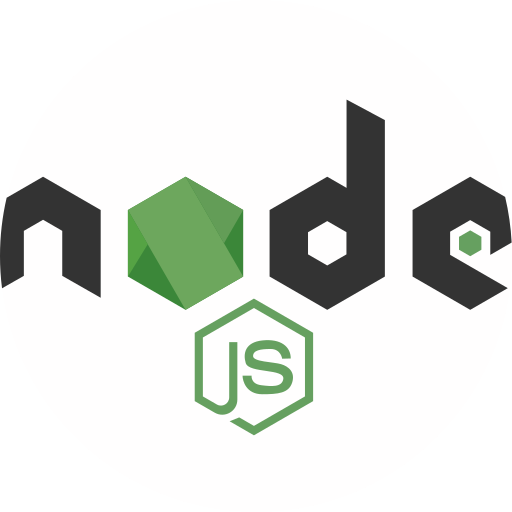

# SignUp-react
Graduation Project
<br>

### About the Project:

<p>This project is a simple Finance Management Software to help Bem-Estar GYM to  </p>

### Tecnologies:

<table>
  <tr>
    <td></td>        
    <td></td>
    <td></td>
    <td></td>
  </tr>
  <tr>
    <td valign="top">Node</td>
    <td valign="top">React</td>
    <td valign="top">Typescript</td>
    <td valign="top">PowerBi</td>
  </tr>
   <tr>
    <td valign="top">v14.16.1</td>
    <td valign="top">v18.1.0</td>
    <td valign="top" style="padding-left: 30px">v4.2.4</td>
    <td valign="top"  style="padding-left: 15px">v2.103</td>
  </tr>
 </table>

<br>
<hr>
<br>

### Folder Architeture:
```shell

  $tree 
└───src
    ├───assets
    │   ├───icon
    │   └───img
    ├───components
    │   ├───modal
    │   └───styled-components
    ├───hooks
    ├───interfaces
    ├───mock
    ├───model
    ├───pages
    ├───providers
    ├───service
    └───utils
```

<br>
<hr>
<br>

### Getting Starter

1. CLI to install dependencies:

<code style="margin-left: 50px">npm i</code>

<br>

2. Run The Project:

<code style="margin-left: 50px">npm run dev</code>

